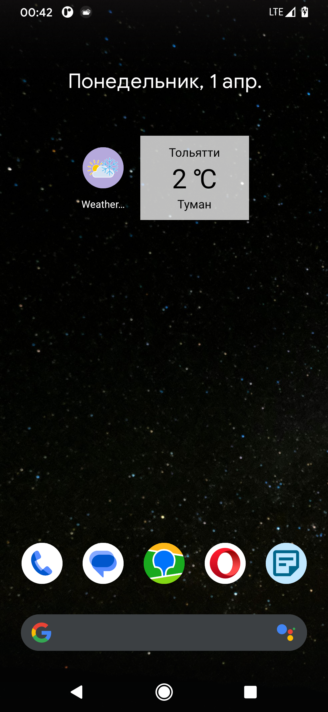
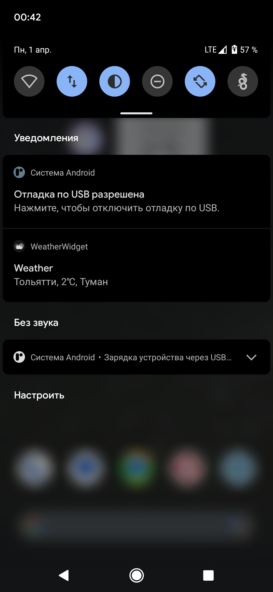
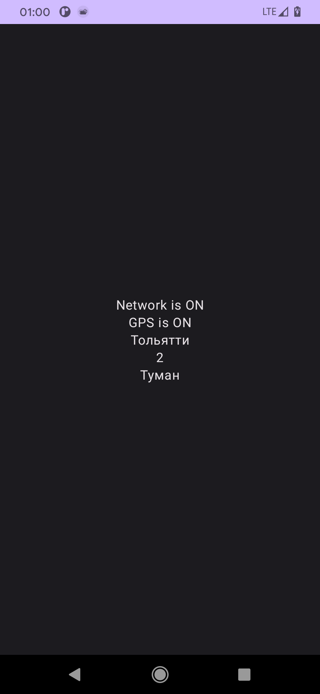

# Weather Widget
Android weather forecast application with widget. Tracks user location and update weather every 5 min.  
Currently in russian. [Click here to get apk][1]

Built with:  
Jetpack Compose  
Jetpack Glance
Foreground Service  
Retrofit  
Hilt  
https://www.weatherapi.com/ as Weather Forecast Provider  

On initial start GPS and Internet must be ON and permission granted.  

  

[1]: <https://kassaev.com/media/weatherWidget.apk>